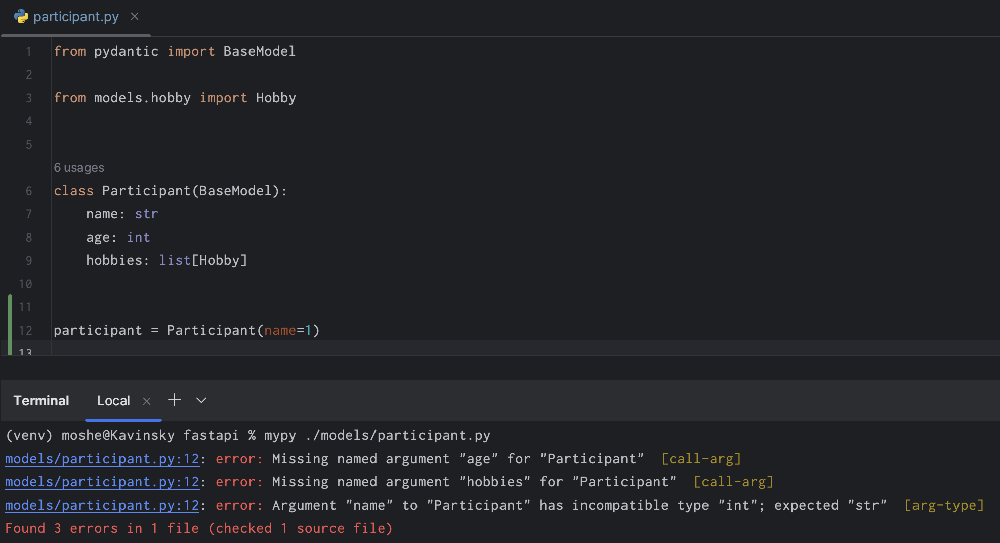
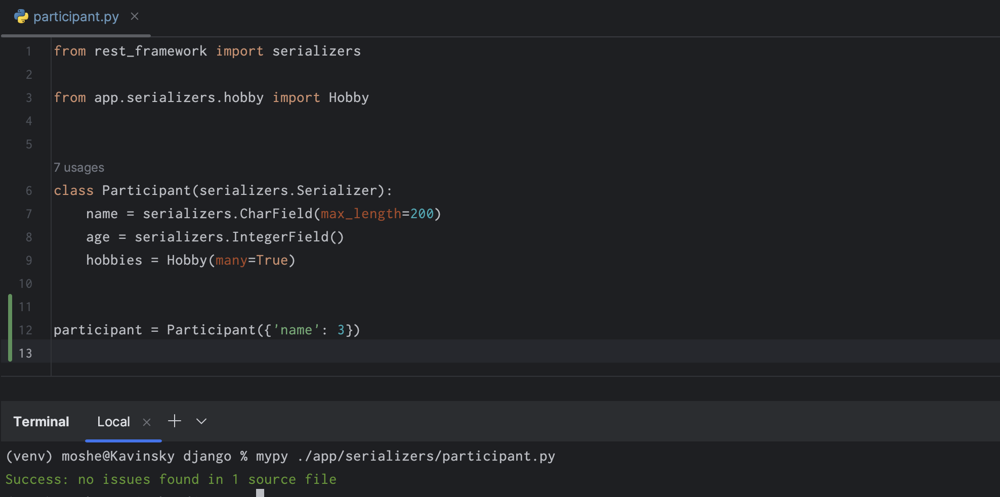
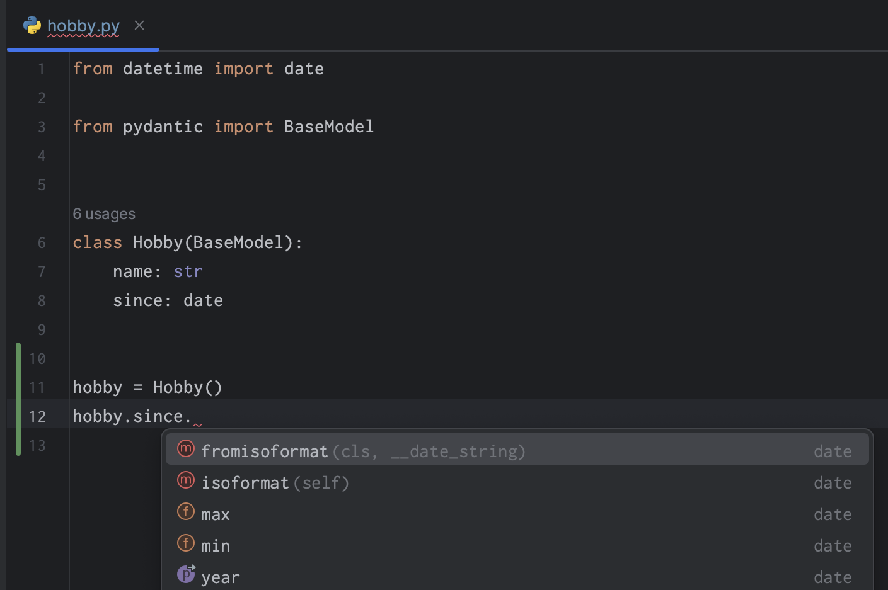
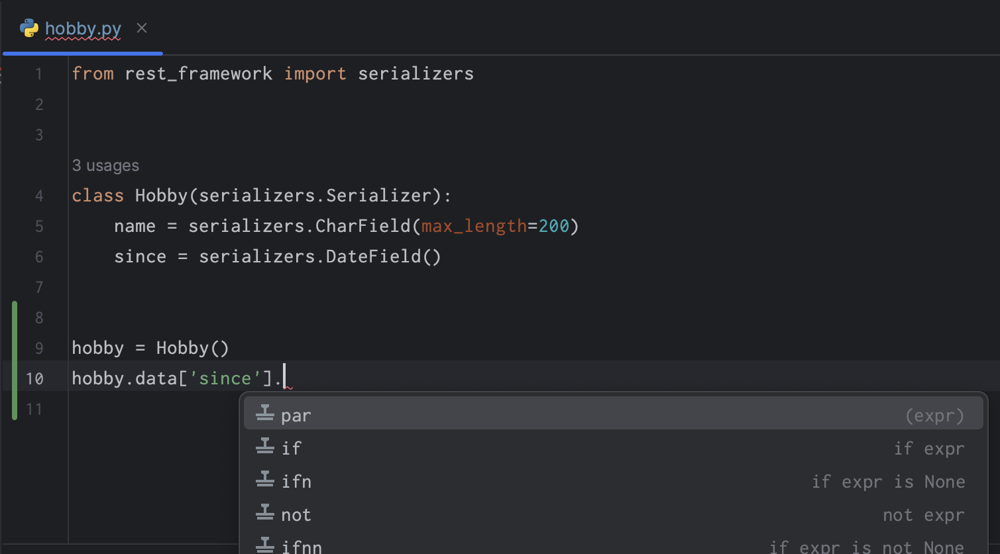
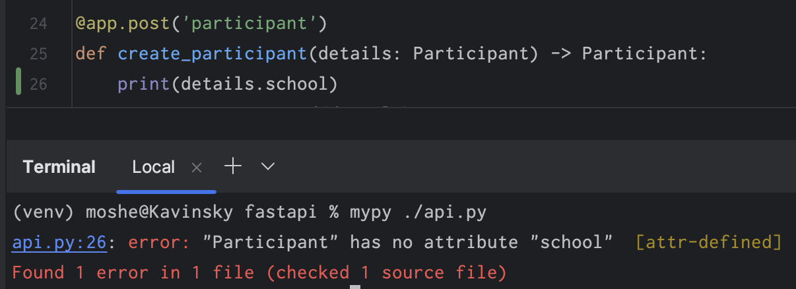
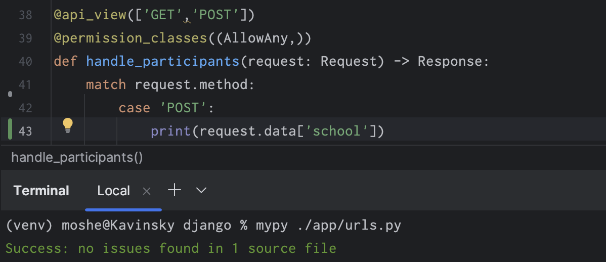
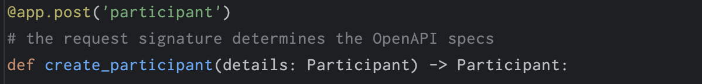
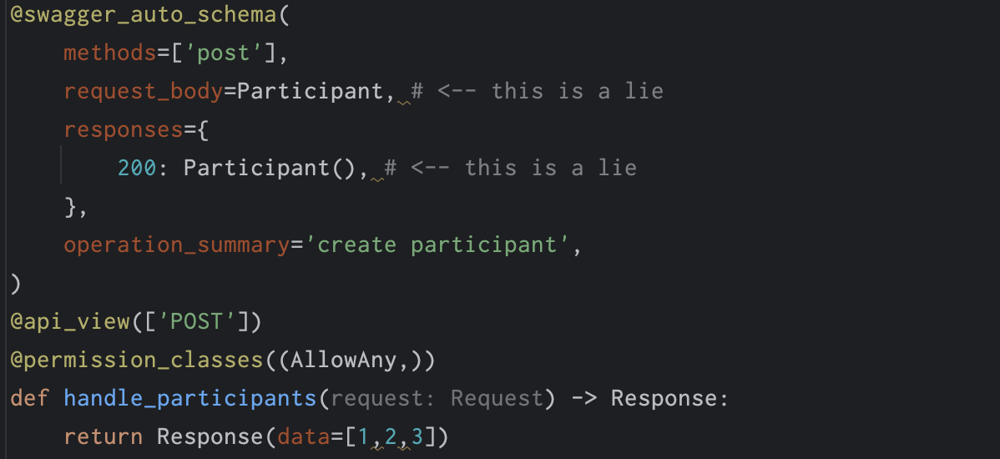

# FastAPI _vs_ Django

## Why FastAPI

- Faster
- Simpler
- More fun
- Less learning
- Cleaner code
- Editor completion and type checks
- data validation based on type hints
- openapi docs based on type hints

## Comparison

|                 | Django                                    | FastAPI                                  |
|-----------------|-------------------------------------------|------------------------------------------|
| Link            | [Website](https://www.djangoproject.com/) | [Website](https://fastapi.tiangolo.com/) |
| Initial Release | 2005                                      | 2018                                     |
| Github Stars    | 75k                                       | 67k                                      |

## Code examples

In this repository the same application is implemented in both frameworks.  

- Compare request description and handling, files [`fastapi/api.py`](https://github.com/moshe-pheno/fastapi-vs-django/blob/main/fastapi/api.py) vs [`django/app/urls.py`](https://github.com/moshe-pheno/fastapi-vs-django/blob/main/django/app/urls.py)
- See [example pull request](https://github.com/moshe-pheno/fastapi-vs-django/pull/1) for a simple change in both frameworks.

## Problems with Django

### Type Checking

Mypy warns about wrong types in fastapi:

But not about django serializers:

### Autocompletion

Pydantic models used by fastapi are recognized by editor:

Django serializers are not:

### Request Signature

Request content can be type-checked in fastapi:

But not in django:

### False OpenAPI Specifications

In fastapi, the OpenAPI apecifications are always the reality:

In djano, the specs can be totally false:

